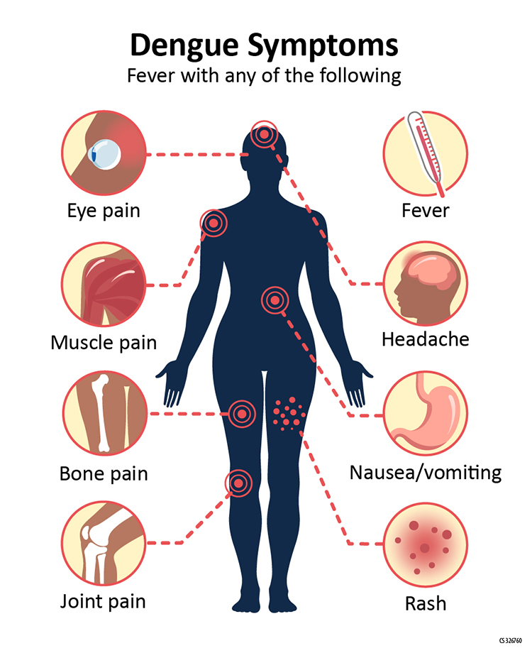

### Agenda

.large[
* Introductions
* Begin logistic regression
* Overview of course details
]

---

### Motivating example: Dengue fever

.large[
**Dengue fever:** a mosquito-borne viral disease affecting 400 million people a year
]

.center[

]

---

### Motivating example: Dengue data

.large[
**Data:** Data on 5720 Vietnamese children, admitted to the hospital with possible dengue fever. Variables include:

* *Sex*: patient's sex (female or male)
* *Age*: patient's age (in years)
* *WBC*: white blood cell count
* *PLT*: platelet count
* other diagnostic variables...
* *Dengue*: whether the patient has dengue (0 = no, 1 = yes)
]

---

### Motivating example: Dengue data

.large[
**Data:** Data on 5720 Vietnamese children, admitted to the hospital with possible dengue fever. Variables include:

* *Sex*: patient's sex (female or male)
* *Age*: patient's age (in years)
* *WBC*: white blood cell count
* *PLT*: platelet count
* other diagnostic variables...
* *Dengue*: whether the patient has dengue (0 = no, 1 = yes)
]

.large[
**Research questions:**

* How well can we predict whether a patient has dengue?
* Which diagnostic measurements are most useful?
* Is there a significant relationship between WBC and dengue?
]

---

### Research questions

.large[
* How well can we predict whether a patient has dengue?
* Which diagnostic measurements are most useful?
* Is there a significant relationship between WBC and dengue?
]

.large[
.question[
How can I answer each of these questions? Discuss with a neighbor for 2 minutes, then we will discuss as a class.
]
]

---

### Fitting a model: initial attempt

.large[
What if we try a linear regression model?

$$Y_i = \text{dengue status of } i\text{th  patient}$$

$$Y_i = \beta_0 + \beta_1 WBC_i + \varepsilon_i \hspace{1cm} \varepsilon_i \overset{iid}{\sim} N(0, \sigma_\varepsilon^2)$$
]

.large[
.question[
What are some potential issues with this linear regression model? Go to [https://pollev.com/ciaranevans637](https://pollev.com/ciaranevans637) to respond.
]
]

---

### Second attempt

.large[
Let's rewrite the linear regression model:
]

---

### Second attempt

.large[
$$Y_i \sim Bernoulli(p_i) \hspace{1cm} p_i = \mathbb{P}(Y_i = 1 | WBC_i)$$

$$p_i = \beta_0 + \beta_1 WBC_i$$
]

.large[
.question[
Are there still any potential issues with this approach?
]
]

---

### Don't fit linear regression with a binary response

```{r setup, echo=F, fig.width=7, fig.height=5, fig.align='center', message=F, warning=F}
library(tidyverse)
dengue <- read.csv("https://sta279-s22.github.io/labs/dengue.csv")

dengue %>%
  ggplot(aes(x = WBC, y = Dengue)) +
  geom_point(size = 2) +
  geom_smooth(method="lm", se=F, lwd=1.5) +
  theme_bw() +
  theme(text = element_text(size = 20))
```

---

### Fixing the issue: logistic regression

.large[
$$Y_i \sim Bernoulli(p_i)$$

$$g(p_i) = \beta_0 + \beta_1 WBC_i$$

where $g: (0, 1) \to \mathbb{R}$ is unbounded.
]

.large[
**Usual choice:** $g(p_i) = \log \left( \dfrac{p_i}{1 - p_i} \right)$
]

---

### Odds

.large[
**Definition:** If $p_i = \mathbb{P}(Y_i = 1 | WBC_i)$, the **odds** are $\dfrac{p_i}{1 - p_i}$

.question[
**Example:** Suppose that $\mathbb{P}(Y_i = 1 | WBC_i) = 0.8$. What are the *odds* that the patient has dengue? Go to [https://pollev.com/ciaranevans637](https://pollev.com/ciaranevans637) to respond.
]

.abox[
(A) 0.8
]

.bbox[
(B) 0.2
]

.cbox[
(C) 4
]

.dbox[
(D) 0.25
]
]

---

### Odds

.large[
**Definition:** If $p_i = \mathbb{P}(Y_i = 1 | WBC_i)$, the **odds** are $\dfrac{p_i}{1 - p_i}$

.question[
The probabilities $p_i \in [0, 1]$. The linear function $\beta_0 + \beta_1 WBC_i \in (-\infty, \infty)$. What range of values can $\dfrac{p_i}{1 - p_i}$ take?
]
]

---

### Log odds

.large[
$$g(p_i) = \log \left(\dfrac{p_i}{1 - p_i}\right)$$
]

---

### Binary logistic regression

.large[
$$Y_i \sim Bernoulli(p_i)$$

$$\log \left(\dfrac{p_i}{1 - p_i}\right) = \beta_0 + \beta_1 WBC_i$$

**Note:** Can generalize to $Y_i \sim Binomial(m_i, p_i)$, but we won't do that yet.
]

---

### Example: simple logistic regression with dengue

.large[
$$Y_i = \text{dengue status (0 = no, 1 = yes)} \hspace{1cm} Y_i \sim Bernoulli(p_i)$$

$$\log \left(\dfrac{\widehat{p}_i}{1 - \widehat{p}_i}\right) = 1.737 - 0.361 \ WBC_i$$

.question[
Work in groups of 2-3 for 5 minutes on the following questions:

* Are patients with a higher WBC more or less likely to have dengue?
* Interpret the estimated slope in context of a unit change in the log odds.
* What is the change in *odds* asociated with a unit increase in WBC?
]
]

---

### Class overview

.large[
Full details of the course can be found in the syllabus:

[https://sta712-f22.github.io/about/](https://sta712-f22.github.io/about/)
]

---

### Class goals

.large[
By the end of this class, you should be able to:

* Use core GLM theory to investigate models with different response variables
* Fit and assess generalized linear models on data to answer real research questions
* Connect GLMs to topics in the broader statistical landscape (e.g. linear regression, classification, GAMs, neural networks)
* Independently learn and apply new statistical topics
]

---

### Course components

.large[
* Regular homework assignments
  * Practice material from class
* Challenge assignments
  * Learn additional material related to course
* 2 take-home exams
  * Demonstrate knowledge of theory and methodology
  * No final exam!
* 2 projects
  * Apply material to real data and real research questions
]

---

### Grading philosophy

.large[
* Focusing on grades can detract from the learning process
* Homework should be an opportunity to *practice* the material. It is ok to make mistakes when practicing, as long as you make an honest effort
* Errors are a good opportunity to learn and revise your work
* Partial credit and weighted averages of scores make the meaning of a grade confusing. Does an 85 in the course mean you know 85% of everything, or everything about 85% of the material?
]

---

### Grading in this course

.large[
* I will give you feedback on every assignment
* Homework is graded on completeness and effort, not correctness
* All other assignments (challenge, exams, projects) are graded as Mastered / Not yet mastered
* If you haven't yet mastered something, you get to try again!
]

---

### Assigning grades: specifications grading

.large[
To get a **B** in the course:

* Receive credit for at least 5 homework assignments
* Master one project
* Master at least 80% of the questions on both exams

To get an **A** in the course:

* Receive credit for at least 5 homework assignments
* Master both projects
* Master at least 80% of the questions on both exams
* Master at least 2 challenge assignments
]

---

### Late work and resubmissions

.large[
* You get a bank of **5** extension days. You can use 1--2 days on any assignment, exam, or project.
* No other late work will be accepted (except in extenuating circumstances!)
* "Not yet mastered" challenge questions, exams, and projects may be resubmitted once
]